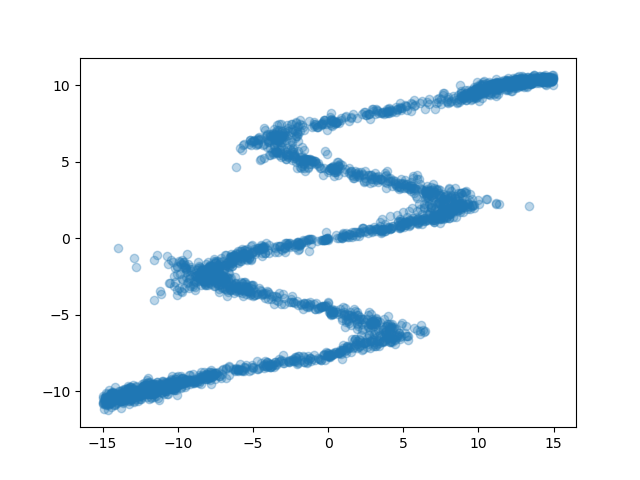
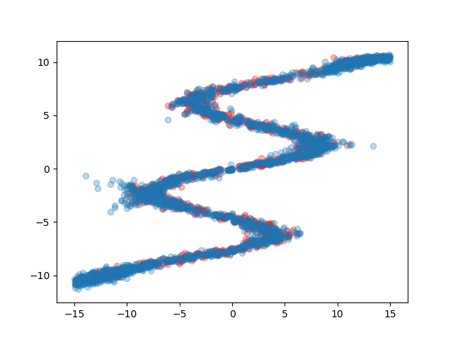
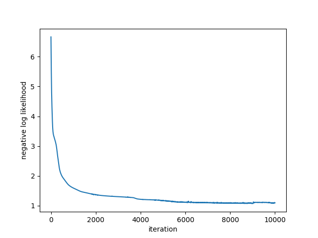

# Mixture Density Network with Chainer

This is an example code of Mixture Density Network implemented with Chainer.
All the parameters, network design, and hwo to prepare synthetic data are the same as this article: [Mixture Density Networks with TensorFlow](http://blog.otoro.net/2015/11/24/mixture-density-networks-with-tensorflow/).

This repository is intended to be a draft for a repository in [chainer/models](https://github.com/chainer/models) which is to collect self-contained Chainer examples.

## Requirements

- Chainer v4.1.0 (not tested, but may work with >=v2.0.0)
- NumPy v1.10.0
- Matplotlib v2.1.2

## Train

```
python train.py
```

## Results

### Target data:


### Generated data from the trained MDN:



### Generated data over the target data:



### Loss curve


